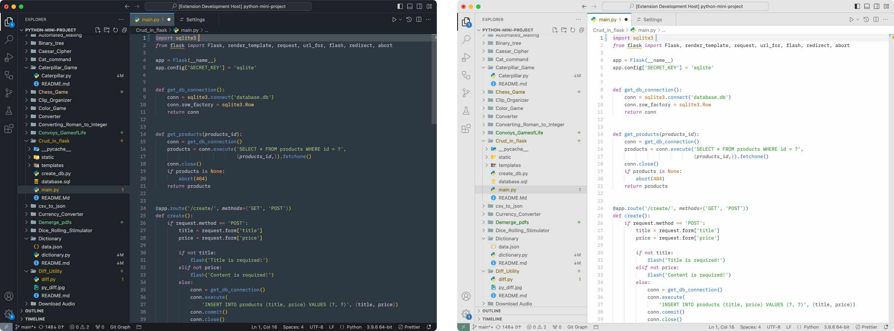

# Mariana Refined Light & Dark Themes for VS Code

    

## Installation

1. Go to [VS Marketplace](https://marketplace.visualstudio.com/items?itemName=mani-sh-reddy.mariana-replica).
2. Click on the "Install" button.
3. Then [select a theme](https://code.visualstudio.com/docs/getstarted/themes#_selecting-the-color-theme).
    - Light: `Mariana Light`
    - Dark: `Mariana Refined (Dark)`